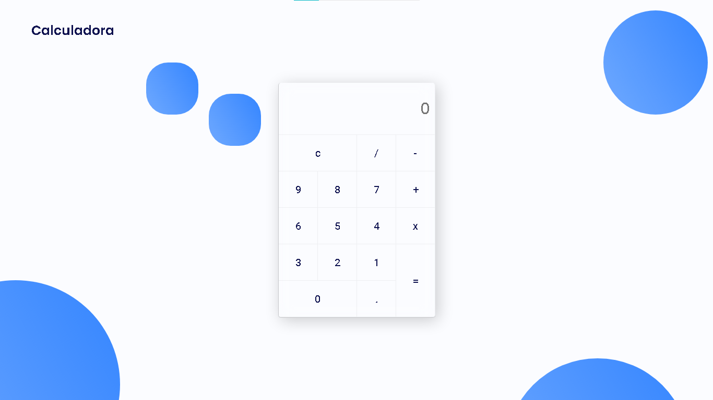

<h1 align="center">Calculator 3D</h1> <!--Title-->

 <!--Sobre / Descrição-->
   3D Calculator using Glassmorphism and Library (<a href="https://micku7zu.github.io/vanilla-tilt.js/" target="_blank">Vanilla.tilt.js</a>).

 <!--Navegação-->
  <h3>
    <a href="https://calculadora3d.netlify.app/">
      Demo
    </a><!--Demonstração-->
  </h3>

<!-- TABLE OF CONTENTS -->

## Table of Contents

- [Overview](#overview)
  - [Built With](#built-with)
- [Features](#features)
- [Contact](#contact)

<!-- OVERVIEW -->

## Overview

### Description
Calculator created for learning. using Glassmorphism properties in CSS and Libraries in Javascript to create the tilt effect. Preview the project in the <a href="https://calculadora3d.netlify.app/">Demo</a>.

### Built With

- [HTML](https://www.w3.org/html/)
- [CSS](https://www.w3.org/Style/CSS/Overview.en.html)
- [Javascript](https://developer.mozilla.org/pt-BR/docs/Web/JavaScript)

## Features
JavaScript library to create tilt effect on calculator.
Design created by me.
And Glassmorphism CSS Properties

## Contact

- Website [brunoguerra.netlify.app](https://brunoguerra.netlify.app/)
- GitHub [@brunorguerra](https://www.github.com/brunorguerra)
- Instagram [@bruno.bernardees](https://www.instagram.com/bruno.bernardees/)
